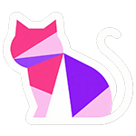
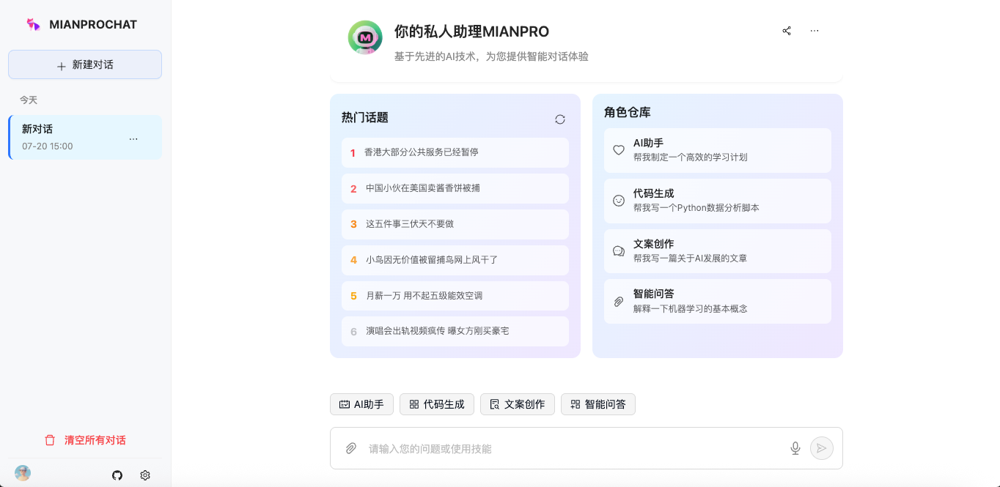
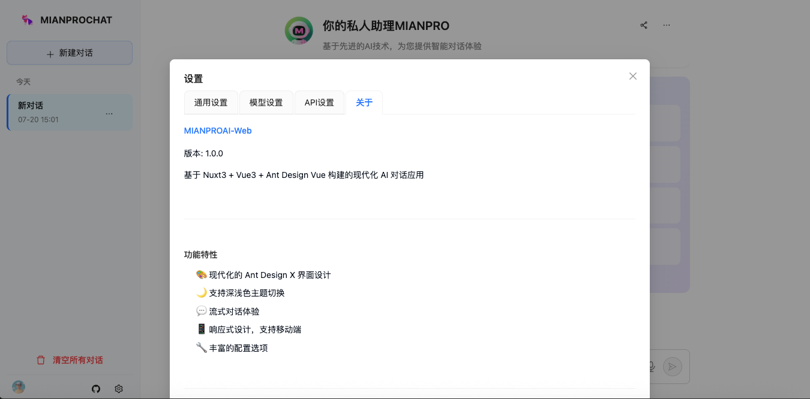
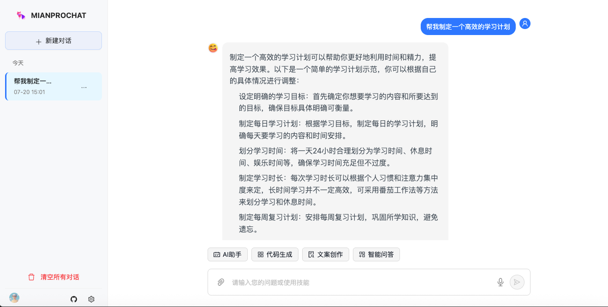

<p align="right">
   <a href="./README.md">中文</a> | <strong>English</strong>
</p>

<div align="center">


# MIANPROAI-WEB
🤖 Modern AI Chat Application Based on Nuxt3 🤖

      
</div>

## 📝 Project Introduction

> [!NOTE]  
> This project is a modern AI chat application developed with Nuxt3 + Vue3 + TypeScript

> [!IMPORTANT]  
> - Support for multiple AI model configurations (GPT-3.5, GPT-4, and custom models)
> - Adopts Ant Design X design language for elegant user interface
> - Support for light/dark theme switching with responsive design for mobile
> - Built-in Electron support for desktop application packaging
> - Streaming conversation experience with real-time AI responses
> - Local storage for conversation history to protect user privacy

### 🌟 Key Features

- **🎨 Modern UI** - Based on Ant Design X design specifications, beautiful and user-friendly interface
- **🌙 Theme Switching** - Support for light/dark themes, follows system settings
- **💬 Streaming Chat** - Real-time AI response display for smooth conversation experience
- **🔧 Flexible Configuration** - Support for custom API endpoints, model parameters, etc.
- **📱 Responsive Design** - Perfect adaptation for desktop and mobile devices
- **💻 Desktop Application** - Support for Electron packaging as cross-platform desktop app
- **🔒 Privacy Protection** - All data stored locally, no server uploads
- **🚀 Quick Deployment** - Support for Vercel, Netlify and other deployment methods

### 📸 Screenshots





## 🚀 Quick Start

### Requirements

- Node.js 18+
- pnpm 8+ (recommended) or npm/yarn

### Local Development

```bash
# Clone the project
git clone https://github.com/kilimro/nuxt3-chatgpt-web.git
cd nuxt3-chatgpt-web

# Install dependencies
pnpm install

# Start development server
pnpm dev
```

Visit `http://localhost:3000` to start using.

### Build for Production

```bash
# Build for production
pnpm build

# Preview build result
pnpm preview
```

## 🖥️ Electron Desktop Application

### Development Mode

```bash
# Start Electron development mode
pnpm electron:dev
```

### Build Desktop Application

```bash
# Build desktop application
pnpm electron:build
```

After building, you can find the installation packages for corresponding platforms in the `electron-dist` directory:
- Windows: `.exe` installer
- macOS: `.dmg` installer  
- Linux: `.AppImage` executable

## ☁️ Online Deployment

### Deploy to Vercel

[](https://vercel.com/new/clone?repository-url=https://github.com/kilimro/nuxt3-chatgpt-web)

### Deploy to Netlify

[](https://app.netlify.com/start/deploy?repository=https://github.com/kilimro/nuxt3-chatgpt-web)

### Deploy to Railway

[](https://railway.app/template/nuxt3-chatgpt-web)

## ⚙️ Configuration

### API Configuration

1. Open application settings page
2. Configure in the "API Settings" tab:
   - **API Endpoint**: Default is `https://api.openai.com`, can be modified to other compatible API endpoints
   - **API Key**: Enter your OpenAI API Key or other service keys

### Model Configuration

Supports the following preset models:
- GPT-3.5 Turbo
- GPT-4
- GPT-4 Turbo

Also supports adding custom models:
1. In the "Model Settings" section of the settings page
2. Click "Add Custom Model"
3. Fill in model name and model ID
4. Save and use in conversations

### Environment Variables

Create a `.env` file and configure the following variables:

```bash
# OpenAI API Configuration
OPENAI_API_KEY=your_openai_api_key
OPENAI_API_BASE_URL=https://api.openai.com

# Application Configuration
NUXT_PUBLIC_APP_NAME=MIANPROAI-Web
NUXT_PUBLIC_APP_DESCRIPTION=AI Chat Application Based on Nuxt3
```

## 📁 Project Structure

```
nuxt3-chatgpt-web/
├── components/          # Vue components
│   ├── ui/             # UI component library
│   ├── AntdChatLayout.vue    # Main layout component
│   ├── AntdChatMessages.vue  # Message list component
│   ├── AntdChatInput.vue     # Input box component
│   └── SettingsPanel.vue    # Settings panel
├── stores/             # Pinia state management
│   ├── chat.ts         # Chat state
│   └── model.ts        # Model state
├── utils/              # Utility functions
│   └── api.ts          # API calls
├── types/              # TypeScript type definitions
├── electron/           # Electron related files
├── assets/             # Static assets
├── pages/              # Page files
└── public/             # Public resources
```

## 🛠️ Tech Stack

- **Frontend Framework**: Nuxt3 + Vue3
- **Development Language**: TypeScript
- **UI Component Library**: Ant Design Vue + shadcn-vue
- **Styling Solution**: Tailwind CSS
- **State Management**: Pinia
- **Desktop Application**: Electron
- **Build Tool**: Vite
- **Package Manager**: pnpm

## 🤝 Contributing

Issues and Pull Requests are welcome!

1. Fork this repository
2. Create your feature branch (`git checkout -b feature/AmazingFeature`)
3. Commit your changes (`git commit -m 'Add some AmazingFeature'`)
4. Push to the branch (`git push origin feature/AmazingFeature`)
5. Open a Pull Request

## 📄 License

This project is licensed under the [MIT License](LICENSE).

## 🙏 Acknowledgments

- [Nuxt.js](https://nuxt.com/) - Excellent Vue.js framework
- [Ant Design Vue](https://antdv.com/) - Enterprise-class UI design language
- [shadcn-vue](https://www.shadcn-vue.com/) - Modern component library
- [Tailwind CSS](https://tailwindcss.com/) - Utility-first CSS framework

## 📞 Contact

- Project Repository: [GitHub](https://github.com/kilimro/nuxt3-chatgpt-web)
- Issue Reports: [Issues](https://github.com/kilimro/nuxt3-chatgpt-web/issues)
- Email: www.kfmao.com@gmail.com

---

<div align="center">

**If this project helps you, please give it a ⭐ Star for support!**

</div>
