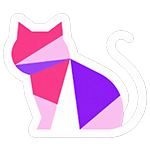
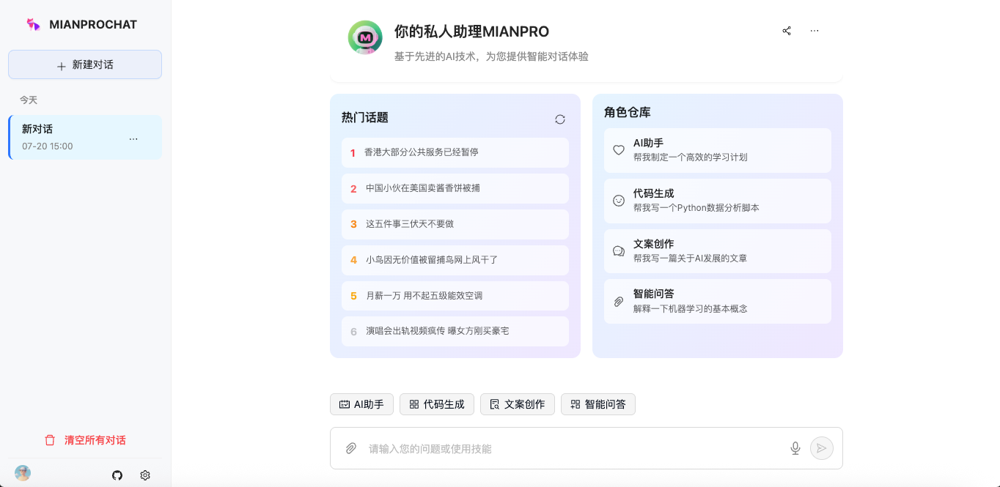
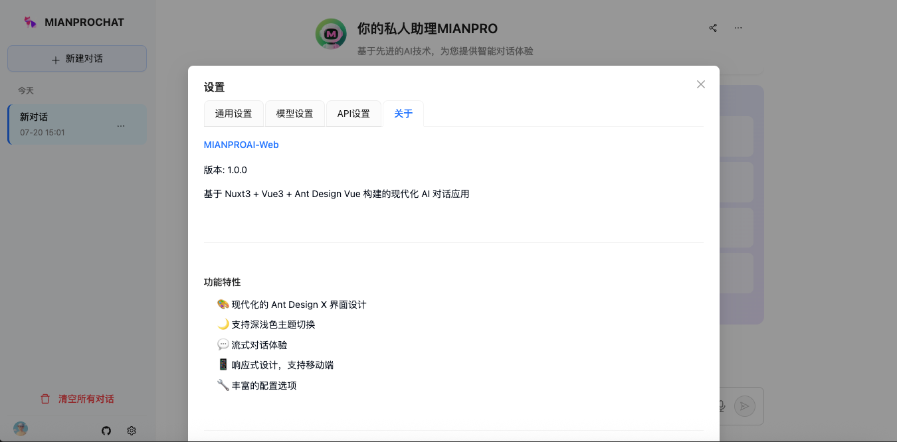
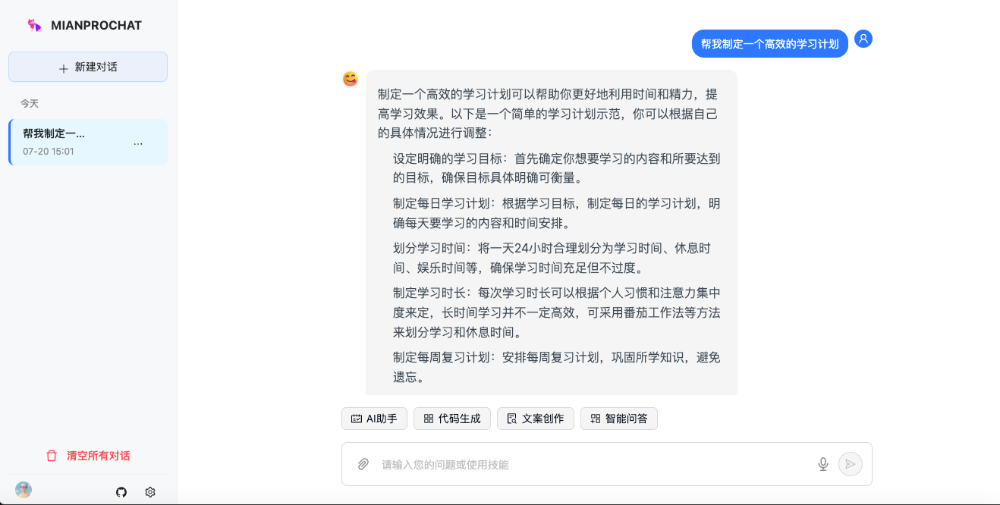

<p align="right">
   <strong>中文</strong> | <a href="./README.en.md">English</a>
</p>

<div align="center">


# MIANPROAI-WEB
🤖 基于 Nuxt3 的现代化 AI 对话应用 🤖

      
</div>

## 📝 项目介绍

> [!NOTE]  
> 本项目是一个基于 Nuxt3 + Vue3 + TypeScript 开发的现代化 AI 对话应用

> [!IMPORTANT]  
> - 支持多种 AI 模型配置（GPT-3.5、GPT-4 及自定义模型）
> - 采用 Ant Design X 设计语言，提供优雅的用户界面
> - 支持深浅色主题切换，响应式设计适配移动端
> - 支持 iframe 嵌入，可轻松集成到其他网站
> - 支持 URL 参数配置 API，无需手动设置
> - 内置 Electron 支持，可打包为桌面应用
> - 流式对话体验，实时显示 AI 回复
> - 本地存储对话历史，保护用户隐私

### 🌟 主要特性

- **🎨 现代化 UI** - 基于 Ant Design X 设计规范，界面美观易用
- **🌙 主题切换** - 支持亮色/暗色主题，跟随系统设置
- **💬 流式对话** - 实时显示 AI 回复，提供流畅的对话体验
- **🔧 灵活配置** - 支持自定义 API 地址、模型参数等
- **📱 响应式设计** - 完美适配桌面端和移动端
- **💻 桌面应用** - 支持 Electron 打包为跨平台桌面应用
- **🔒 隐私保护** - 所有数据本地存储，不上传服务器
- **🚀 快速部署** - 支持 Vercel、Netlify 等多种部署方式
- **🔗 iframe 嵌入** - 完美支持嵌入到其他网站，无需额外配置
- **⚡ URL 参数配置** - 通过 URL 参数快速配置 API，即开即用

### 📸 效果展示





## 🚀 快速开始

### 环境要求

- Node.js 18+
- pnpm 8+ (推荐) 或 npm/yarn

### 本地开发

```bash
# 克隆项目
git clone https://github.com/kilimro/nuxt3-chatgpt-web.git
cd nuxt3-chatgpt-web

# 安装依赖
pnpm install

# 启动开发服务器
pnpm dev
```

访问 `http://localhost:3000` 即可开始使用。

## 🔗 iframe 嵌入使用

### 基础嵌入

```html
<iframe 
  src="https://your-domain.com/" 
  width="100%" 
  height="600px"
  frameborder="0">
</iframe>
```

### 通过 URL 参数配置 API

```html
<iframe 
  src="https://your-domain.com/?server=https://api.openai.com&key=sk-xxx" 
  width="100%" 
  height="600px"
  frameborder="0">
</iframe>
```

**URL 参数说明：**
- `server`: API 服务器地址（可选）
- `key`: API 密钥（可选）
- 默认模型：GPT-3.5 Turbo
- 参数会自动保存到本地存储，URL 会被清理保持干净

**使用示例：**
```
https://your-domain.com/?server=https://api.openai.com&key=sk-xxx
https://your-domain.com/?server=https://api.deepseek.com&key=your-key
https://your-domain.com/?key=sk-xxx  # 仅配置密钥，使用默认服务器
```

### 构建部署

```bash
# 构建生产版本
pnpm build

# 预览构建结果
pnpm preview
```

## 🖥️ Electron 桌面应用

### 开发模式

```bash
# 启动 Electron 开发模式
pnpm electron:dev
```

### 构建桌面应用

```bash
# 构建桌面应用
pnpm electron:build
```

构建完成后，可在 `electron-dist` 目录找到对应平台的安装包：
- Windows: `.exe` 安装包
- macOS: `.dmg` 安装包  
- Linux: `.AppImage` 可执行文件

## ☁️ 在线部署

### Vercel 部署

[](https://vercel.com/new/clone?repository-url=https://github.com/kilimro/nuxt3-chatgpt-web)

### Netlify 部署

[](https://app.netlify.com/start/deploy?repository=https://github.com/kilimro/nuxt3-chatgpt-web)

### Railway 部署

[](https://railway.app/template/nuxt3-chatgpt-web)

## ⚙️ 配置说明

### API 配置

支持多种配置方式：

#### 方式一：URL 参数配置（推荐）
直接在 URL 中传递参数，无需手动设置：
```
https://your-domain.com/?server=https://api.openai.com&key=sk-xxx
```

#### 方式二：设置页面配置
1. 打开应用设置页面
2. 在 "API设置" 标签页中手动配置：
   - **API 地址**: 默认为 `https://api.openai.com`，可修改为其他兼容的 API 地址
   - **API 密钥**: 输入您的 OpenAI API Key 或其他服务的密钥

### 模型配置

支持以下预设模型：
- GPT-3.5 Turbo
- GPT-4
- GPT-4 Turbo

同时支持添加自定义模型：
1. 在设置页面的 "模型设置" 中
2. 点击 "添加自定义模型"
3. 填写模型名称和模型 ID
4. 保存后即可在对话中使用

### 环境变量

创建 `.env` 文件并配置以下变量：

```bash
# OpenAI API 配置
OPENAI_API_KEY=your_openai_api_key
OPENAI_API_BASE_URL=https://api.openai.com

# 应用配置
NUXT_PUBLIC_APP_NAME=MIANPROAI-Web
NUXT_PUBLIC_APP_DESCRIPTION=基于 Nuxt3 的 AI 对话应用

# iframe 嵌入配置（可选）
# 如果需要限制嵌入域名，可以配置 CSP 策略
```

## 📁 项目结构

```
nuxt3-chatgpt-web/
├── components/          # Vue 组件
│   ├── ui/             # UI 组件库
│   ├── AntdChatLayout.vue    # 主布局组件
│   ├── AntdChatMessages.vue  # 消息列表组件
│   ├── AntdChatInput.vue     # 输入框组件
│   └── SettingsPanel.vue    # 设置面板
├── stores/             # Pinia 状态管理
│   ├── chat.ts         # 对话状态
│   └── model.ts        # 模型状态
├── utils/              # 工具函数
│   └── api.ts          # API 调用
├── types/              # TypeScript 类型定义
├── electron/           # Electron 相关文件
├── assets/             # 静态资源
├── pages/              # 页面文件
└── public/             # 公共资源
```

## 🛠️ 技术栈

- **前端框架**: Nuxt3 + Vue3
- **开发语言**: TypeScript
- **UI 组件库**: Ant Design Vue + shadcn-vue
- **样式方案**: Tailwind CSS
- **状态管理**: Pinia
- **桌面应用**: Electron
- **构建工具**: Vite
- **包管理器**: pnpm

## 🤝 贡献指南

欢迎提交 Issue 和 Pull Request！

1. Fork 本仓库
2. 创建您的特性分支 (`git checkout -b feature/AmazingFeature`)
3. 提交您的更改 (`git commit -m 'Add some AmazingFeature'`)
4. 推送到分支 (`git push origin feature/AmazingFeature`)
5. 打开一个 Pull Request

## 📄 开源协议

本项目基于 [MIT License](LICENSE) 开源协议。

## 🙏 致谢

- [Nuxt.js](https://nuxt.com/) - 优秀的 Vue.js 框架
- [Ant Design Vue](https://antdv.com/) - 企业级 UI 设计语言
- [shadcn-vue](https://www.shadcn-vue.com/) - 现代化组件库
- [Tailwind CSS](https://tailwindcss.com/) - 实用优先的 CSS 框架

## 📞 联系方式

- 项目地址: [GitHub](https://github.com/kilimro/nuxt3-chatgpt-web)
- 问题反馈: [Issues](https://github.com/kilimro/nuxt3-chatgpt-web/issues)

---

<div align="center">

**如果这个项目对您有帮助，请给个 ⭐ Star 支持一下！**
**如果该项目对您有帮助，欢迎打赏**

</div>
